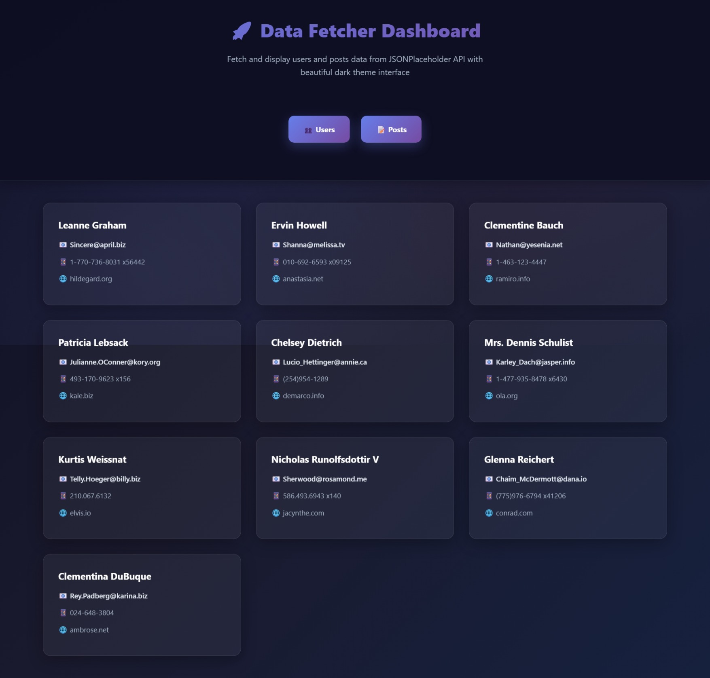
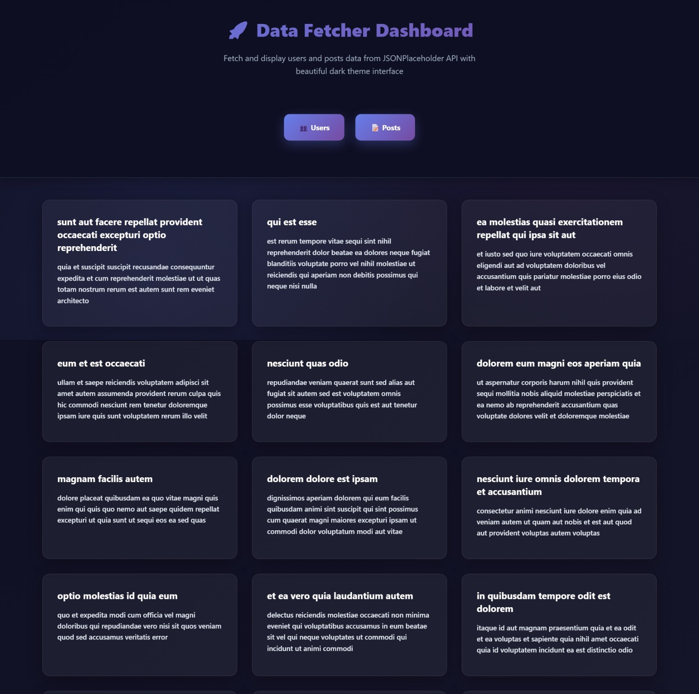

# 🌐 Data Fetcher Dashboard - Modern API Data Display

## 📸 Project Showcase

<div align="center">

### 🌐 Data Fetcher Interface


### 📊 Users Data Display


### 📝 Posts Data Display


</div>

<div align="center">

> *Professional dark-themed data fetcher with JSONPlaceholder API integration and beautiful glassmorphism UI*

</div>

---

## 📋 Table of Contents
- [📋 Project Overview](#-project-overview)
- [✨ Features](#-features)
- [🛠️ Technologies Used](#️-technologies-used)
- [📁 Project Structure](#-project-structure)
- [🎨 Design Features](#-design-features)
- [🚀 Getting Started](#-getting-started)
- [🎯 Key Features](#-key-features)
- [🌐 API Integration](#-api-integration)
- [📱 User Experience](#-user-experience)
- [🌟 Special Thanks](#-special-thanks)

---

## 📋 Project Overview

**Data Fetcher Dashboard** is a sophisticated, dark-themed web application that fetches and displays users and posts data from the JSONPlaceholder API. Built entirely with vanilla JavaScript, HTML5, and CSS3, this project showcases modern API integration, elegant UI design, and professional data visualization without external dependencies. Perfect for developers, students, and professionals who need a powerful data display tool with beautiful interface.

---

## ✨ Features

### 🎯 **API Data Integration**
- JSONPlaceholder API integration for users and posts
- Real-time data fetching and display
- Error handling for API failures
- Clean data presentation with user-friendly formatting
- Responsive data loading states

### 🌐 **Users Data Display**
- Complete user information (name, email, phone, website)
- Professional card-based layout
- Clean typography and spacing
- Hover effects and smooth transitions
- Mobile-responsive design

### 📝 **Posts Data Display**
- Post titles and content display
- Organized card layout for easy reading
- Professional text formatting
- Consistent styling with users section
- Responsive grid system

### 🎨 **Professional User Interface**
- Dark theme with modern color scheme
- Glassmorphism design elements
- Smooth hover effects and animations
- Professional typography and spacing
- Elegant shadows and borders
- Interactive navigation buttons

### 🚀 **Technical Excellence**
- Pure vanilla JavaScript implementation
- Clean separation of concerns (HTML, CSS, JS)
- Event-driven architecture
- Cross-browser compatibility
- No external dependencies
- Responsive design principles

---

## 🛠️ Technologies Used

- **HTML5** - Semantic structure, navigation, and content display
- **CSS3** - Advanced styling, glassmorphism effects, and responsive design
- **Vanilla JavaScript** - DOM manipulation, API integration, and data handling
- **Modern UI/UX** - Professional dark theme and glassmorphism design
- **Responsive Design** - Adaptive layout system for all screen sizes

---

## 📁 Project Structure

```
data-fetcher-dashboard/
├── index.html              # Main interface with navigation and data display
├── script.js               # API integration, data fetching, and DOM manipulation
├── style.css               # Complete dark theme styling with glassmorphism
├── README.md               # This file
└── images/                 # Project images and assets
    ├── dashboard-showcase.png  # Main dashboard preview
    ├── users-showcase.png      # Users data preview
    └── posts-showcase.png      # Posts data preview
```

---

## 🎨 Design Features

- **Dark Theme** - Professional dark color scheme throughout
- **Glassmorphism** - Modern frosted glass effects with backdrop blur
- **Interactive Elements** - Hover effects and smooth transitions
- **Professional Typography** - Clear, readable data display
- **Elegant Shadows** - Depth and visual hierarchy
- **Responsive Layout** - Adapts to different screen sizes
- **Navigation Buttons** - Professional gradient buttons for data switching
- **Consistent Styling** - Unified design language across all components

---

## 🚀 Getting Started

1. **Clone the repository**
   ```bash
   git clone https://github.com/alhussienhazem/data-fetcher-dashboard.git
   ```

2. **Open in your browser**
   - Open `index.html` in your web browser
   - Click "👥 Users" to fetch and display users data
   - Click "📝 Posts" to fetch and display posts data
   - Enjoy the beautiful dark theme interface

---

## 🎯 Key Features

- ✅ **API Integration** - JSONPlaceholder API for real data
- ✅ **Users Display** - Complete user information with professional layout
- ✅ **Posts Display** - Post titles and content with clean formatting
- ✅ **Dark Theme** - Professional dark color scheme
- ✅ **Error Handling** - Graceful handling of API failures
- ✅ **Pure JavaScript** - No external dependencies
- ✅ **Responsive Design** - Works on all screen sizes
- ✅ **Glassmorphism** - Modern UI with frosted glass effects
- ✅ **Live Data** - Real-time API data fetching
- ✅ **Professional UI** - Beautiful and intuitive interface

---

## 🌐 API Integration

| Endpoint | Description | Data Displayed |
|----------|-------------|----------------|
| **Users API** | `https://jsonplaceholder.typicode.com/users` | Name, Email, Phone, Website |
| **Posts API** | `https://jsonplaceholder.typicode.com/posts` | Title, Content Body |
| **Error Handling** | Graceful fallback for API failures | User-friendly error messages |
| **Loading States** | Smooth data fetching experience | Professional loading indicators |

---

## 📱 User Experience

### 🎨 **Visual Design**
- **Dark theme** - Professional dark color scheme with gradients
- **Glassmorphism** - Modern frosted glass effects
- **Card layout** - Organized data display in beautiful cards
- **Navigation buttons** - Professional gradient buttons
- **Hover effects** - Interactive feedback on all elements
- **Smooth animations** - Professional transitions throughout

### 🌐 **Data Flow**
1. **Click Users** - Fetch users data from API
2. **Display Cards** - Show user information in beautiful cards
3. **Click Posts** - Fetch posts data from API
4. **Display Content** - Show post titles and content
5. **Error Handling** - Clear feedback for any API issues
6. **Responsive Design** - Perfect display on all devices

### 🎯 **Learning Benefits**
- **API Integration** - Working with external APIs and data fetching
- **DOM manipulation** - Dynamic content creation and display
- **Event handling** - Click events and user interactions
- **Error handling** - Graceful API failure management
- **Professional UI/UX** - Modern design principles and glassmorphism
- **Code organization** - Clean separation of HTML, CSS, and JavaScript

---

## 🌟 Special Thanks

- **Instructor Badr** - For assigning this comprehensive data fetching and display task
- **Modern web standards** - For enabling powerful API integration and CSS3 features
- **Vanilla JavaScript** - For robust data fetching and DOM manipulation capabilities
- **JSONPlaceholder API** - For providing reliable test data for development
- **Glassmorphism design** - For inspiring modern UI design principles

---

*Built with ❤️ for learning advanced API integration, data visualization, and modern UI design principles*
